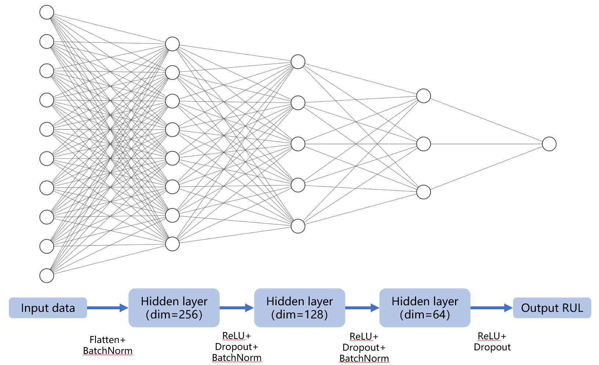
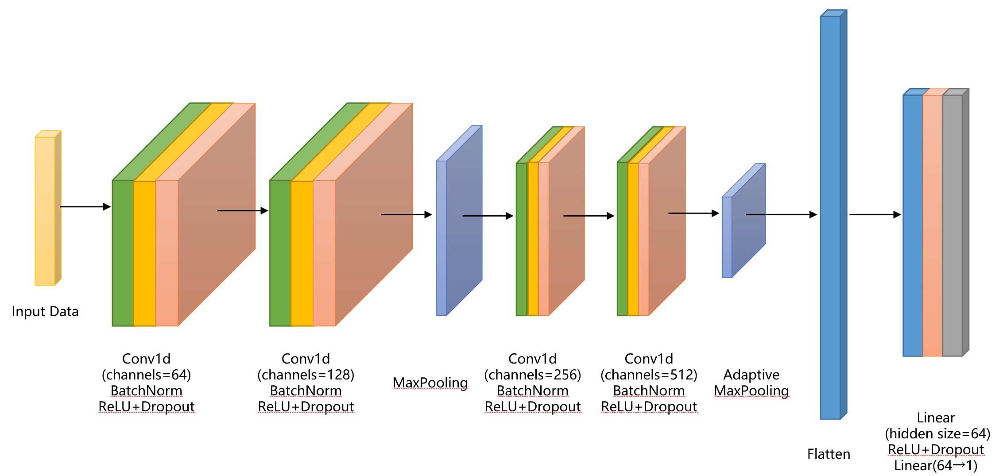
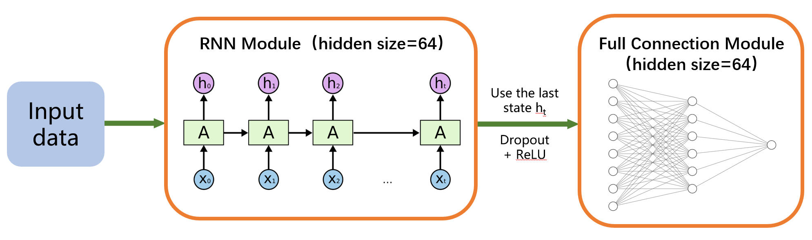
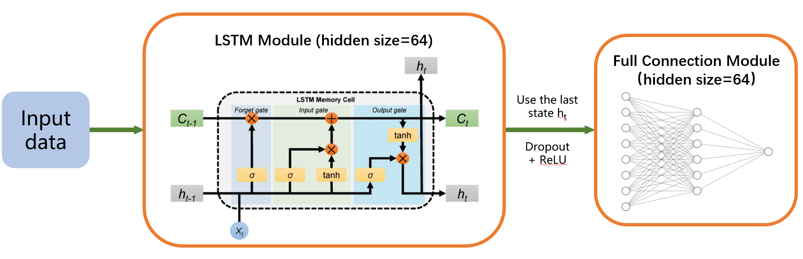
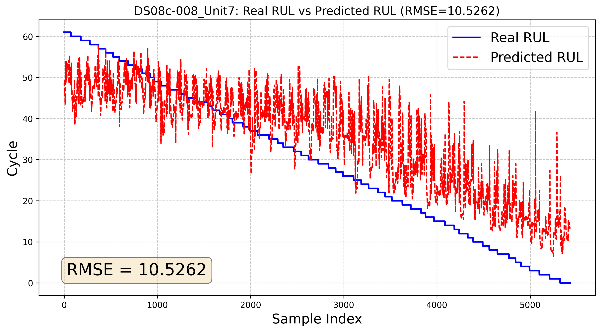
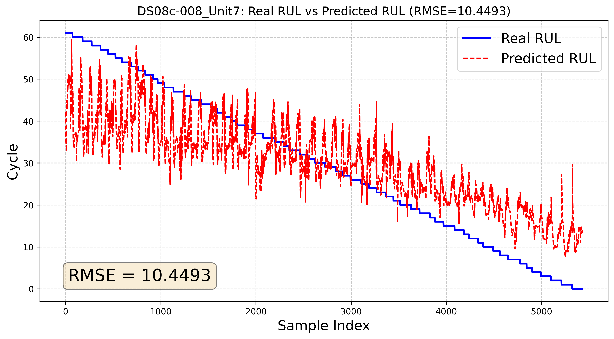
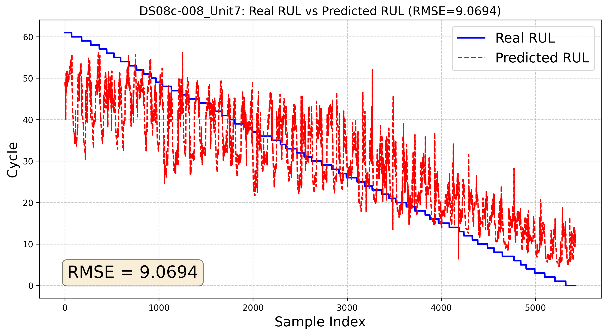
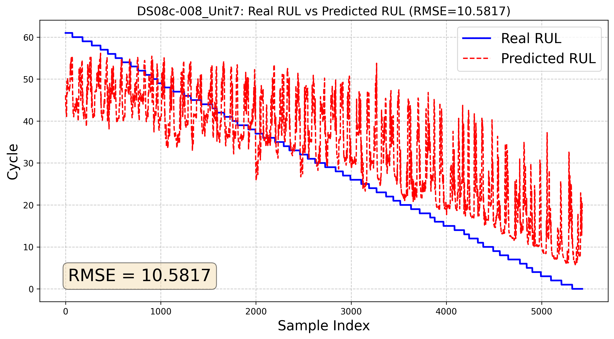

# N-CMAPSS-DG
基于领域泛化的航空发动机剩余寿命预测
Domain generalization based turbofan engine RUL prediction using N-CMAPSS dataset 

***

## 项目介绍
- 本项目围绕航空发动机剩余寿命预测问题，引入领域泛化（DG，Domain Generalization）的思想，在N-CMAPSS数据集上进行实验验证
- 目前baseline部分代码已完成，领域泛化部分代码仍在编写

## 运行方法
- `./utils/config.py` 为模型超参数配置文件，运行前需检查数据存储路径 ``data_path`` 是否正确
- ``baseline.py`` 为模型训练主函数，直接运行开始训练，不引入DG方法，结果保存在 ``./results/`` 中
- ``load_and_test.py`` 可实现加载训练好的模型进行测试

## 文件说明
- ``./models/`` 文件夹包括不同模型类文件
- ``./utils/`` 文件夹包括运行时所需的工具函数
    - ``dataset.py`` 实现数据集读取与窗口分割
    - ``logger.py`` 实现日志记录初始化
    - ``loss.py`` 定义了DG所需的若干种损失
    - ``tools.py`` 包括早停机制和梯度反转层
    - ``visualization.py`` 为模型结果可视化程序，包括损失函数曲线、模型预测结果散点图与RUL随时间变化曲线的绘制

--- 

## baseline

### 模型结构

MLP | CNN
:-----: | :-----:
 | 
**RNN** | **LSTM**
 | 

### RUL预测结果
- ``num_epochs = 10``
- 源域为 DS01-DS08a 等 8 条数据的 development set
- 目标域为 DS08c 的 test set

MLP | CNN
:-----: | :-----:
 | 
**RNN** | **LSTM**
 | 

***

